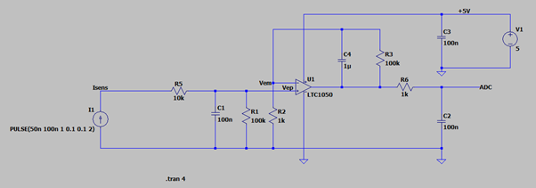
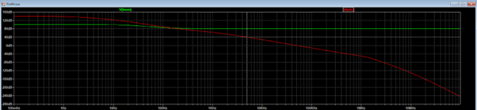
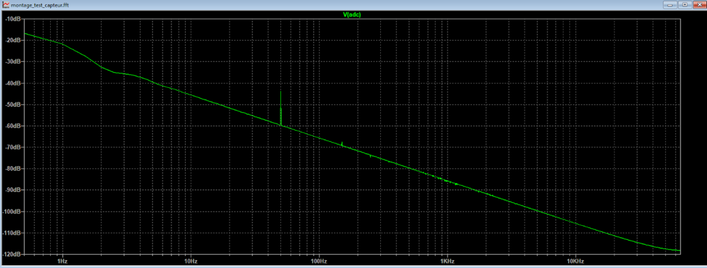
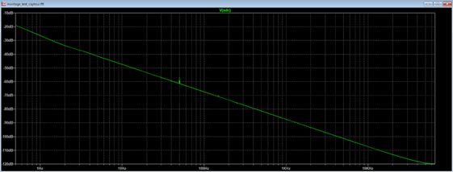
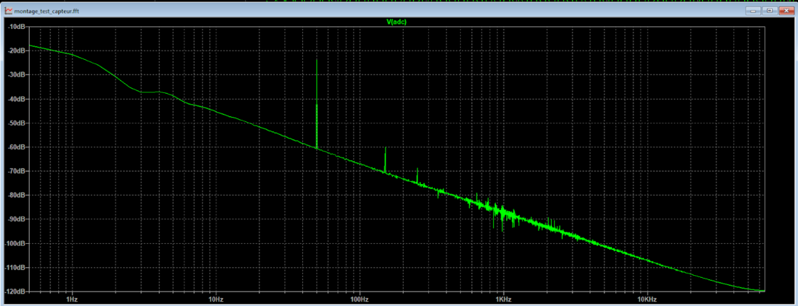
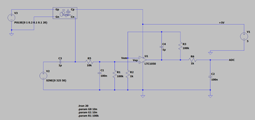
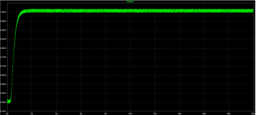
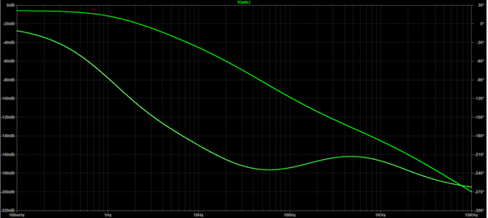

# Projet : Capteur Graphite à Crayon

## Table des matières
- [Contexte](#contexte)
- [Réalisation du projet](#réalisation-du-projet)
  - [1. Matériaux utilisés](#1-matériaux-utilisés)
  - [2. Simulation électronique en utilisant LTSpice](#2-simulation-électronique-en-utilisant-ltspice)
  - [3. Conception du circuit PCB en utilisant KiCad](#3-conception-du-circuit-pcb-en-utilisant-kicad)
    - [Réalisation du symbole des composants](#réalisation-du-symbole-des-composants)
    - [Réalisation du schéma électronique](#réalisation-du-schéma-électronique)
    - [Réalisation des empreintes des composants](#réalisation-des-empreintes-des-composants)
    - [3.4 Réalisation du PCB](#34-réalisation-du-pcb)
  - [4. Code Arduino](#4-code-arduino)
  - [5. Application Android via MIT App Inventor](#5-application-android-via-mit-app-inventor)
  - [6. Réalisation du Shield](#6-réalisation-du-shield)
  - [7. Banc de test](#7-banc-de-test)
  - [8. Datasheet](#8-datasheet)
- [Conclusion](#conclusion)
- [Références](#références)
- [Contacts](#contacts)

## Contexte
Ce projet vise à développer un capteur basé sur du graphite de crayon pour des applications en instrumentation. L'objectif est d'explorer les propriétés conductrices du graphite et de les exploiter dans un circuit électronique interactif.

# Réalisation du projet

### 1. Matériaux utilisés

Dans ce projet, nous utilisons des composants électroniques et des modules disponibles dans la salle d'instrumentation avec une carte Arduino UNO. Tous les composants sont listés ci-dessous :
   * 1 carte Arduino UNO
   * 1 module Bluetooth HC-05
   * 1 encodeur rotatif
   * 1 écran OLED
   * 1 capteur de flexion commercial
   * 1 capteur graphite à crayon
   * 1 amplificateur de transimpédance LTC1050
   * 1 potentiomètre numérique
   * 2 supports IC
   * 1 résistance 1kΩ, 1 résistance 10kΩ, 2 résistances 100kΩ
   * 3 condensateurs 100nF, 1 condensateur 1µF

### 2. Simulation électronique en utilisant LTSpice

#### Fonctionnalité de condition nominale

Le courant d’entrée Isens varie entre 50 nA et 100 nA, ce qui entraîne une variation de la tension Vep appliquée à l’entrée non-inverseur V+ du LTC1050, entre 5 mV et 10 mV.

Le gain de l’amplificateur du LTC1050 est défini par : G = 1 + R3/R2 = 101. Par conséquent, la valeur de la tension de sortie du LTC1050 varie entre 0.5 V et 1 V.

Au départ, le signal exprimé en décibels est de 140 dB, ce qui correspond à :  
20 log(VADC / Isens).

Le microcontrôleur utilisé est un Arduino UNO, basé sur un microcontrôleur AVR avec une fréquence d’échantillonnage maximale fech = 200 kHz.  
Comme la conversion analogique-numérique se fait sur 13 bits, la fréquence d’échantillonnage réelle est limitée à 15.4 kHz.

D'après le théorème de Nyquist, la fréquence maximale du signal que l'on peut correctement numériser doit donc être inférieure à la moitié de cette valeur :  
fsignal < fech/2 = 7.7 kHz.

---

#### Modélisation du capteur

Le bruit à 50 Hz, généré notamment par l'écran TFT (bruit de type secteur), est clairement observé dans le spectre du signal. Pour l’atténuer, on agit sur le condensateur C4 du filtre passe-bas.

- Lorsque la valeur de C4 est augmentée à 10 µF, le pic de bruit à 50 Hz est fortement réduit, ce qui indique une amélioration de l’atténuation dans les basses fréquences.

- En revanche, si on diminue la valeur de C4, le bruit augmente, montrant que la fréquence de coupure du filtre remonte et que le bruit secteur passe plus facilement.

---

#### Résultats visuels

Une photo démontrant que notre circuit permet une amplification efficace du signal délivré par le capteur :

---

#### Simulation du signal alternatif

Ensuite, on présente la réponse du circuit lorsque l'on simule un courant alternatif, afin de vérifier que le bruit est correctement filtré :

Le bruit du réseau est atténué d'environ 72 dB à 50 Hz.

### 3. Conception du circuit PCB en utilisant KiCad

Afin de concevoir le circuit électronique sur lequel sera branché l'ensemble des modules arduino, le logiciel KiCad a été utilisé.
L'impression du circuit s'est ensuite faite par méthode chimie:
   * Plaque de cuivre/résine dont la face en cuivre est enduite d'une résine photosensible;
   * Insolation de la résine sur les parties du cuivre non voulue;
   * Attaque chimique dans un bain révélateur;
   * Rinçage du circuit;

#### Réalisation du symbole des composants :
Pour commencer notre circuit de PCB, il est nécessaire de créer les symboles des composants qui ne sont pas disponibles dans la bibliothèque de KiCad. Nous réalisons les symboles du module Bluetooth, de l'encodeur rotatif, du capteur de flexion, etc., afin de les ajouter au schéma de connexion entre les composants et la carte Arduino UNO.

#### Réalisation du schéma électronique :
Nous avons conçu le schéma électronique en utilisant KiCad, en intégrant les composants nécessaires et en optimisant les connexions pour minimiser les interférences et les pertes de signal.

#### Réalisation des empreintes des composants :

#### 3.4 Réalisation du PCB
Le circuit imprimé a été dessiné avec une attention particulière portée à la disposition des pistes pour minimiser les couplages parasites et faciliter le routage manuel.

---

### 4. Code Arduino
Le code Arduino permet de lire les valeurs du capteur graphite, de gérer l'affichage OLED, la communication Bluetooth et le contrôle via l'encodeur rotatif.

---

### 5. Application Android via MIT App Inventor
Une application mobile a été développée pour :
- Recevoir les données en Bluetooth,
- Afficher les mesures en temps réel,
- Interagir avec le capteur de manière intuitive.

---

### 6. Réalisation du Shield
Un shield personnalisé a été conçu pour s’adapter à l’Arduino UNO, permettant un branchement propre et sécurisé de tous les composants.

---

### 7. Banc de test
Afin de valider le fonctionnement du système, plusieurs tests ont été réalisés :
- Vérification des connexions,
- Mesure des signaux et tensions aux points clés,
- Test de communication Bluetooth.

Les tests ont permis d’identifier et de corriger certains dysfonctionnements avant la fabrication du PCB final.

---

### 8. Datasheet
Les fiches techniques des principaux composants (LTC1050, HC-05, écran OLED, etc.) sont disponibles dans le dossier `datasheet/` du projet.

---

## Conclusion
Ce projet démontre la faisabilité d’un capteur à base de graphite de crayon pour des applications d’instrumentation. Le prototype final est capable de détecter des variations de résistance liées à la pression exercée sur le graphite. Des perspectives d’amélioration incluent l’intégration d’un microcontrôleur plus performant, une alimentation autonome, et un PCB plus compact.

---

## Références
- Fiches techniques des composants (LTC1050, HC-05, etc.)
- Documentation Arduino
- Tutoriels MIT App Inventor
- Outils de simulation LTSpice et KiCad

---

## Contacts

### Étudiants
- **Yoann Lai Koun Sing** : laikouns@insa-toulouse.fr  
- **Viet Hoang Pham** : vpham@insa-toulouse.fr  
- **Ly Hai Hoang** : lhoang@insa-toulouse.fr  

### Enseignants
- **Jérémie Grisolia** : jeremie.grisolia@insa-toulouse.fr
